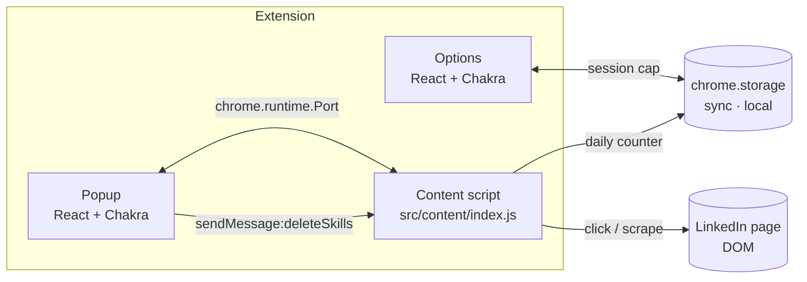

# Linkit

Chrome extension (MV3) that auto-connects with People You May Know on LinkedIn and bulk-deletes profile skills.

## Install

### Option A — Prebuilt release (recommended)

1. Go to the [Releases page](https://github.com/faketut/Linkit/releases) and download the latest `linkit-vX.Y.Z.zip`.
2. Unzip it — you'll get a folder (e.g. `linkit-v0.1.0/`) containing `manifest.json`.
3. Open `chrome://extensions` (or `edge://extensions`, `brave://extensions`).
4. Toggle **Developer mode** (top-right).
5. Click **Load unpacked** → select the unzipped folder.

To update: download the new zip, unzip, then on the Linkit row in `chrome://extensions` click the refresh icon (or remove + Load unpacked again).

### Option B — Build from source

```sh
npm install
npm run build
```

Then in `chrome://extensions`: enable **Developer mode** → **Load unpacked** → select `dist/`.

## Use

1. Sign in to LinkedIn.
2. Click the Linkit icon, then:
   - **People You May Know** — opens `/mynetwork/`, press **START** to auto-connect.
   - **Search People** — same, from People search.
   - **Delete All Skills** — wipes your skills list.

Press **STOP** any time. Per-session cap is set on the Options page.

## Architecture



| Path                   | Purpose                                                     |
| ---------------------- | ----------------------------------------------------------- |
| `manifest.config.js`   | MV3 manifest (consumed by `@crxjs/vite-plugin`).            |
| `vite.config.js`       | Build pipeline.                                             |
| `src/popup/`           | Popup React app.                                            |
| `src/options/`         | Options React app.                                          |
| `src/content/index.js` | Content script — auto-connect + skill-deletion + messaging. |
| `src/shared/`          | Constants, atoms, theme, popup-side actions.                |
| `images/`              | Extension icons.                                            |
| `dist/`                | Build output. Load this as the unpacked extension.          |

## Develop

Requires **Node 20 LTS**.

```sh
npm run dev           # vite build --watch
npm run build         # production → dist/
npm run lint          # ESLint
npm run format        # Prettier (writes)
npm run format:check
```

Reload the Linkit row in `chrome://extensions` after each build.

CI (`.github/workflows/ci.yml`) runs lint + format:check + build on push and PR.

**Stack:** React 18 · Chakra UI v2 · Jotai · Vite 5 · `@crxjs/vite-plugin` · ESLint 9 + Prettier 3.

## ⚠️ Safety

LinkedIn enforces invitation limits (~80–100/week) and may restrict or suspend abusive accounts. Linkit:

- Waits a randomised **3–8 s** between clicks.
- Stops at the **per-session cap** (default 100, configurable).
- Stops at the **per-day cap** (40, persisted in `chrome.storage.local`).
- Detects LinkedIn's "invite limit reached" modal and bails out.

Use at your own risk; lower the caps if unsure.

## Troubleshooting

- **START does nothing on My Network** — LinkedIn changed the card layout; update `Selectors.ConnectButtonFromMyNetworkPage` in [src/shared/constants.js](src/shared/constants.js).
- **Counter stalls below cap** — invite-limit modal triggered; check the page console for `[Linkit]` warnings. Wait a week.
- **Skill deletion stalls** — fragile selectors; refresh and retry. Errors log as `Linkit: error deleting skill: …`.
